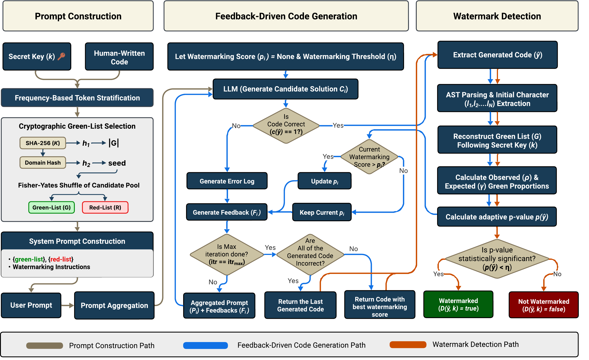

<div align="center">

# PromptMark
## A Prompt-Guided Iterative-Feedback Framework for Source Code Watermarking

**Status:** ✅ Accepted (ENASE 2026)

<!-- [📄 Paper](#paper) • [🔗 Quick Start](#quick-start) • [📊 Results](#evaluation-results) • [📦 Datasets](#datasets) • [🔍 Evaluation](#evaluation-results) -->

</div>

---

## 📋 Overview

PromptMark is a **black-box, prompt-guided code watermarking framework** that embeds imperceptible yet statistically detectable signals into source code generated by large language models. Unlike existing white-box approaches requiring access to model internals, PromptMark operates through structured prompts alone, making it practical for real-world API-based LLM services.

### Key Contributions
- 🎯 **First prompt-only watermarking approach** for source code in black-box settings
- 📊 **Frequency-based token stratification** derived from human-written code
- 🔄 **Iterative feedback loop** that jointly optimizes for correctness and watermark fidelity
- 📈 **Strong empirical results**: AUROC 0.90–0.98 across MBPP and HumanEval

---

## 📊 Quick Facts

<div align="center">

| Metric | MBPP | HumanEval |
|--------|------|-----------|
| **AUROC (Best)** | 0.994 | 0.970 |
| **TPR @ 1% FPR** | 96.7% | 90.0% |
| **Pass% (Correctness)** | 96.8% | 94.0% |
| **Models Tested** | Gemini 2.5 Flash, Claude Sonnet 4 |

</div>

---

<a id="quick-start"></a>
## 🚀 Quick Start

The fastest reproducible path is:
1. **Configure environment and credentials**
2. **Run generation experiments** (expT, expS, expA, expI, expX)
3. **Run evaluation scripts** for correctness, watermark detection, and CodeBLEU

### Environment Setup

From repository root:

```bash
pip install -r requirements.txt
```

Set required credentials and model configuration:

```bash
# Configure credentials for your LLM provider
# AWS Bedrock: AWS_ACCESS_KEY_ID, AWS_SECRET_ACCESS_KEY, AWS_DEFAULT_REGION
# Anthropic: ANTHROPIC_API_KEY
# Google Gemini: GOOGLE_API_KEY

export DEFAULT_MODEL="<your-model-id>"
```
---

## 📂 Repository Structure

```
promptmark/
├── datasets/              # Benchmark datasets (HumanEval, MBPP)
├── src/                   # Core implementation
│   ├── llm_providers.py   # Multi-provider LLM interface
│   ├── watermarking/      # Watermarking algorithms
│   ├── run_experiments.sh # Main experiment runner
│   └── notebooks/         # Analysis notebooks
├── scripts/
│   ├── evals/             # Evaluation utilities
│   ├── metrics/           # Metric computation
│   └── analysis/          # Statistical analysis
└── results/               # Experiment outputs
```

---

## 🧬 Methodology Overview

### Three-Phase Framework

<div align="center">



</div>

**Key Design Principle:** Green-list characters are derived from frequent identifier initials in human-written code, ensuring naturalness while maintaining statistical separability.

---

## ⚙️ Running Experiments

---

<a id="datasets"></a>
## 📦 Datasets

Core benchmark datasets used in experiments:

| Dataset | File | Size | Description |
|---------|------|------|-------------|
| **HumanEval** | `datasets/human_eval_164.jsonl` | 164 problems | Algorithmic code generation task |
| **MBPP** | `datasets/sanitized-mbpp.json` | 427 problems | Utility-style code generation task |
| **MBPP (Sample)** | `datasets/sanitized-mbpp-sample-100.jsonl` | 100 problems | Reduced set for quick experiments |

---

## 🧪 Experiment Runner

Main experiment runner from repository root:

```bash
cd src
./run_experiments.sh [METHOD] [DATASET] [SAMPLE_SIZE]
```

### Watermarking Methods

| Method | Code | Description |
|--------|------|-------------|
| **Baseline (No Watermark)** | `expT` | Code-only generation without watermarking |
| **Static Watermarking** | `expS` | Fixed green/red lists per prompt |
| **Comment + Identifier** | `expA` | Green-list applied to identifiers & comments |
| **Iterative Refinement** | `expI` | Iterative feedback loop with evaluation |
| **Post-hoc Refactoring** | `expX` | LLM-based semantic-preserving refactoring |

### Usage Examples

```bash
# All methods on HumanEval, sample 100 problems
./run_experiments.sh all humaneval 100

# Single method quick test (2 problems)
./run_experiments.sh expA humaneval 2

# Multiple methods
./run_experiments.sh expT,expS,expA humaneval 50
```

**Generated Output:**
- Generated code: `output/<model>_<exp>_<mode>_<version>_<sample>_<dataset>/`
- Results CSV: `results/raw/<model>_<exp>_<mode>_<version>_<sample>_<dataset>.csv`

---

## 📊 Evaluation Results

### Evaluation Utilities

Run evaluation from repository root using one of the following approaches:

#### Option 1: Automatic Evaluation (First Available Experiment)

```bash
# List all available experiments
python scripts/evals/quick_eval.py --list_available

# Automatically evaluate first available experiment
python scripts/evals/quick_eval.py --auto_evaluate --output results/auto_eval.json
```

#### Option 2: Manual Evaluation with Explicit Paths

```bash
# Set experiment parameters
PROVIDER="claude"          # claude | gemini | gpt | mistral | local
METHOD="expA"              # expT | expS | expA | expI | expX
MODE="during_gen"
VERSION="v1"
SAMPLE="2"
DATASET="humaneval"        # humaneval | mbpp

# Define file paths
CSV_FILE="results/raw/${PROVIDER}_${METHOD}_${MODE}_${VERSION}_${SAMPLE}_${DATASET}.csv"
GEN_DIR="output/${PROVIDER}_${METHOD}_${MODE}_${VERSION}_${SAMPLE}_${DATASET}"
REF_FILE="datasets/human_eval_164.jsonl"  # or sanitized-mbpp.json

# Run evaluation
python scripts/evals/quick_eval.py \
  --csv_file "$CSV_FILE" \
  --generated_dir "$GEN_DIR" \
  --reference_file "$REF_FILE" \
  --codebleu_sample_size "$SAMPLE" \
  --output "results/eval_${PROVIDER}_${METHOD}_${DATASET}.json"
```

#### Option 3: Batch Evaluation

```bash
# Evaluate all available experiments
python scripts/evals/batch_eval.py --experiments all --output results/batch_eval.json

# Evaluate specific experiment set
python scripts/evals/batch_eval.py \
  --experiments claude_expA_during_gen_v1_2_humaneval gemini_expI_during_gen_v1_100_mbpp \
  --output results/batch_eval_selected.json
```

---

## 📈 Key Results

### Watermark Detection Performance (Iterative-AGL)


<div align="center">

| Model-Dataset | AUROC ↑ | T@1%F ↑ | T@5%F ↑ | Pass% ↑ | CodeBLEU ↑ |
|---------------|--------|--------|--------|---------|-----------|
| Gemini-MBPP | **0.994** | **0.967** | **0.979** | 96.79% | 0.460 |
| Gemini-HumanEval | **0.970** | **0.900** | **0.900** | 88.90% | 0.480 |
| Claude-MBPP | 0.987 | 0.870 | 0.940 | 93.60% | 0.470 |
| Claude-HumanEval | 0.930 | 0.640 | 0.710 | 94.00% | 0.480 |

**AUROC:** Area under ROC curve (0.5 = random, 1.0 = perfect)  
**T@1%F / T@5%F:** True positive rate at 1% and 5% false positive rate  
**Pass%:** Functional correctness (unit tests passed)

</div>

### Performance Highlights

- ✅ **Strong Detection:** AUROC consistently above 0.90 across all configurations
- ✅ **High TPR:** 90%+ true positive rate at 5% FPR
- ✅ **Maintained Correctness:** 88–97% of generated code passes functional tests
- ✅ **Preserved Structure:** CodeBLEU scores comparable to non-watermarked baseline
- ✅ **Robustness:** Minimal degradation (−3.8%) under comment removal; managed under targeted refactoring (−27.4%)

---

<!-- Citation will be added when published -->

</div>

---

## 🔧 Advanced Configuration

### Custom Provider Setup

The repository supports multiple LLM providers through a unified interface:

- **AWS Bedrock:** Claude, Mistral, others
- **OpenAI:** GPT-4, GPT-3.5
- **Anthropic:** Claude (direct API)
- **Google Vertex AI:** Gemini models
- **Local:** Ollama, vLLM-compatible servers

See [src/llm_providers.py](src/llm_providers.py) for provider-specific configuration.

### Prompt Customization

System prompts are constructed dynamically based on:
- Secret key (determines green-list cryptographically)
- Frequency-based token stratification
- Identifier/comment constraints

See [PROMPT_TEMPLATES.md](PROMPT_TEMPLATES.md) for template details.

---

## 📊 Metrics Explained


| Metric | Definition | Range |
|--------|-----------|--------|
| **AUROC** | Area under ROC curve; overall detection discriminability | 0–1 (higher is better) |
| **TPR / FPR** | True positive / false positive rates at specific thresholds | 0–1 |
| **T@x%F** | True positive rate at x% false positive rate (e.g., T@5%F) | 0–1 |
| **Pass%** | Percentage of generated code passing all unit tests | 0–100% |
| **CodeBLEU** | Structural similarity (AST + dataflow focus) | 0–1 |
| **p-value** | Statistical significance of green-list character frequency | 0–1 (lower = more significant) |

---

## ✅ Verification Checklist

After any experiment run, verify completeness:

```bash
# Check result CSV exists
ls -lah results/raw | head

# Check generated code files
find output -maxdepth 2 -type f | head

# Inspect results structure
python - <<'PY'
import pandas as pd
csv_path = 'results/raw/<experiment>.csv'
df = pd.read_csv(csv_path)
print(f"Rows: {len(df)}")
print(f"Columns: {list(df.columns)[:8]}")
print(df.head(2))
PY
```

